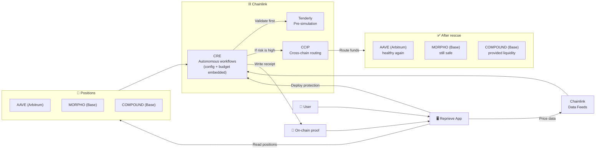

<aside>
🛡️

**Reprieve — cross-protocol stop-loss that protects DeFi positions across multiple venues, automatically.** Powered by Chainlink CRE × Data Feeds × CCIP.

</aside>

---

## What is Reprieve?

In January 2026, **$429 million was liquidated on Aave alone** in a single week — the vast majority triggered by manual misses. Users with positions across multiple protocols and chains had no unified protection. Alerts arrived too late. Manual monitoring didn't scale. Single-protocol tools like DeFi Saver and Gelato couldn't connect positions cross-chain.

**Reprieve changes this.** It monitors health factors across **Aave, Compound, and Morpho** simultaneously. When aggregate risk crosses your threshold, it executes a coordinated rescue — withdrawing collateral from the safest position first, same-chain priority, cross-chain via **CCIP** as escalation. Every rescue is pre-validated through **Tenderly simulation** and logged immutably on-chain.

> _"You didn't open an app. You didn't click a button. You didn't even know it happened — until the rescue log proved it did."_

---

## Demo flow

A simple story that shows what Reprieve can do end-to-end.

| **Moment**          | **What the user sees**                                                                                                 | **What Reprieve is doing (behind the scenes)**                                                                                                                                                                   |
| ------------------- | ---------------------------------------------------------------------------------------------------------------------- | ---------------------------------------------------------------------------------------------------------------------------------------------------------------------------------------------------------------- |
| 1) Connect          | The dashboard shows 3 positions: **Aave (Arbitrum)**, **Compound (Base)**, **Morpho (Arbitrum)**. Everything is green. | Reads positions across protocols and chains, and builds one risk view.                                                                                                                                           |
| 2) Set protection   | The user sets a threshold and a max spend (budget). They choose “use my safest position first”.                        | Generates a **CRE workflow** with the user's settings embedded — config + budget live inside the workflow, not on a centralized server.                                                                          |
| 3) Market shock     | BTC drops sharply. One card turns orange then red: Aave is getting close to liquidation.                               | Uses **Chainlink Data Feeds** plus off-chain risk signals (volatility, funding rates) to react quickly during major market moves, then re-checks the user's risk across venues.                                  |
| 4) Automatic rescue | The UI shows “Rescue in progress”. It pulls funds from the safest place (for the demo: **Compound on Base**).          | **Chainlink CRE** coordinates the actions — including a **Tenderly pre-simulation** to validate before executing. If rescue liquidity is on another chain, **CCIP** routes it cross-chain to where it is needed. |
| 5) Confirm + proof  | The risky position becomes healthy again. A “receipt” page shows what moved, from where, and the before/after health.  | Writes an on-chain record so anyone can verify the outcome independently.                                                                                                                                        |

<aside>
🎬

**Key takeaway:** Reprieve is not just alerts. It is **monitoring + execution + verification**, across chains.

</aside>

### Visual flow (single glance)

<aside>
🧾

This diagram is intentionally partner-level: **Reprieve App** is the experience, **CRE** is the automation brain, **CCIP** is the cross-chain “delivery”, and the **on-chain proof** is the audit trail.

</aside>

---

## Core capabilities

- **Detects** — reads positions from Aave, Compound, and Morpho; fetches prices from Chainlink Data Feeds; incorporates off-chain quant signals (volatility, funding rates, spreads) for richer risk models
- **Evaluates** — computes aggregate health factor, checks budget caps, builds a priority queue, and pre-simulates the rescue via Tenderly
- **Rescues** — executes same-chain withdrawals first; escalates to cross-chain collateral rescue via CCIP when needed; holds funds in RescueEscrow if the bridge fails
- **Logs** — writes an immutable on-chain audit trail of every action: protocol, amount, chains, gas, timestamp

One workflow. One execution. **Set it and forget it.**

---

## Chainlink Ecosystem (high-level)

Reprieve is built on Chainlink because cross-chain, cross-protocol automation needs a **trusted execution layer**.

| **Chainlink Product**                   | **What it enables for Reprieve**                                                                                                                                                                                                                   |
| --------------------------------------- | -------------------------------------------------------------------------------------------------------------------------------------------------------------------------------------------------------------------------------------------------- |
| **CRE (Chainlink Runtime Environment)** | Autonomous monitoring and execution with **hybrid compute** — combines on-chain Data Feeds with off-chain quant signals (volatility, funding rates). Config + budget embedded in the workflow. Reprieve reacts without a centralized bot operator. |
| **CCIP**                                | Cross-chain routing, so liquidity can come from where it is safest and arrive where it is needed.                                                                                                                                                  |
| **Data Feeds**                          | Reliable price inputs used to understand risk during fast market moves.                                                                                                                                                                            |

---

## Key highlights

- **Cross-protocol monitoring** (Aave · Compound · Morpho)
- **Hybrid risk model** (on-chain prices + off-chain quant signals)
- **Cross-chain rescue routing** (same-chain first, CCIP escalation)
- **Tenderly pre-simulation** (validate before executing)
- **Budget guard** (per-rescue + daily caps)
- **Rescue escrow** (funds held safely if cross-chain transfer fails)
- **On-chain audit trail** (verifiable history)

---

## Links

- [Reprieve](https://www.notion.so/Reprieve-b86efc329f5f453fbbc1106def76e98e?pvs=21)
- [Reprieve — Jobs to be Done](https://www.notion.so/Reprieve-Jobs-to-be-Done-9cc0c8daa3d94c5e84971317eb403693?pvs=21)
- [Reprieve — Architecture](https://www.notion.so/Reprieve-Architecture-4bffd8ba9f0849f49ee3d505e4896197?pvs=21)

---

<aside>
⛓️

**Trustless. Verifiable. Automatic.** — Your positions protect themselves.

</aside>
